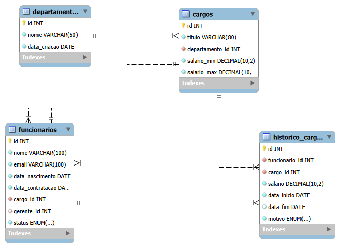

# Análise de RH com MySQL — Modelagem, Hierarquia e Trajetória de Carreira

Projeto de portfólio em SQL focado em **modelagem de banco de dados relacional do zero** e em **queries analíticas** para responder perguntas de negócio típicas de um setor de RH: headcount, salários, tempo até promoção, turnover e estrutura de liderança.

Ao invés de projetos baseados em datasets prontos, aqui o banco foi **desenhado primeiro** (tabelas, chaves primárias e estrangeiras, normalização) e só depois populado com dados fictícios gerados via Python + Faker, respeitando as regras de negócio definidas no schema (ex: um funcionário só pode ter cargos do seu próprio departamento).

## Diagrama Entidade-Relacionamento



O banco tem 4 tabelas:

- **`departamentos`** — departamentos da empresa
- **`cargos`** — cargos existentes, cada um vinculado a um departamento, com faixa salarial (`salario_min` / `salario_max`)
- **`funcionarios`** — dados de cada funcionário, incluindo um **auto-relacionamento** (`gerente_id` aponta para outro `id` da própria tabela `funcionarios`), usado para representar a hierarquia de liderança
- **`historico_cargos`** — o "diário" da carreira de cada funcionário: todo evento de contratação, promoção ou desligamento vira um registro aqui, com datas de início/fim e o salário daquele período

## Por que essa modelagem

- **Normalização**: o departamento de um funcionário não é armazenado diretamente na tabela `funcionarios` — ele é obtido através do cargo (`funcionarios → cargos → departamentos`), evitando duplicar essa informação.
- **Histórico separado do estado atual**: `funcionarios.cargo_id` guarda só o cargo *atual*; toda a trajetória (inclusive o cargo atual, identificado pelo registro com `data_fim IS NULL`) fica em `historico_cargos`. Isso permite reconstruir a carreira completa de qualquer pessoa.
- **Hierarquia via self-reference**: `gerente_id` referencia a própria tabela `funcionarios`, permitindo consultas de estrutura organizacional sem precisar de uma tabela extra.

## Geração dos dados

Os dados são 100% fictícios, gerados pelo script [`gerar_dados.py`](gerar_dados.py) com a biblioteca [Faker](https://faker.readthedocs.io/), respeitando as regras abaixo:

- 5 departamentos, cada um com 4 níveis de cargo (Jr, Pleno, Sênior, Gerente) — 20 cargos no total
- 60 funcionários, distribuídos de forma hierárquica: Gerentes não têm líder acima; Sêniors/Plenos se reportam ao Gerente do seu departamento; Jrs se reportam a um Sênior/Pleno
- Para cada funcionário, o histórico de carreira é reconstruído desde a contratação até o cargo atual (ex: um funcionário Sênior tem 3 registros em `historico_cargos`: contratação como Jr → promoção a Pleno → promoção a Sênior)
- ~5% dos funcionários são marcados como inativos, com um registro de desligamento, permitindo calcular turnover

## Queries analíticas

Todas as queries estão em [`queries_analiticas.sql`](queries_analiticas.sql), com comentários explicando a lógica de cada uma. Resumo do que cada uma responde:

| # | Pergunta de negócio | Conceito de SQL usado |
|---|---|---|
| 1 | Quantos funcionários ativos cada departamento tem? | `JOIN` em cadeia, `GROUP BY` |
| 2 | Qual o salário médio por departamento e cargo? | `JOIN` com condição composta, `AVG` |
| 3 | Quanto tempo em média até a primeira promoção, por departamento? | CTE (`WITH`), `DATEDIFF` |
| 4 | Quais foram os maiores saltos salariais em uma promoção? | Window function `LAG() OVER (PARTITION BY ... ORDER BY ...)` |
| 5 | Qual a taxa de turnover por departamento? | Contador condicional (`SUM(CASE WHEN ...)`) |
| 6 | Quantos subordinados diretos cada líder tem? | Self-join |

### Alguns insights encontrados

- O tempo médio até a primeira promoção varia entre departamentos: RH e Financeiro promovem mais rápido (~14 meses), enquanto Marketing é o mais lento (~18 meses).
- A taxa de turnover está baixa e distribuída de forma relativamente uniforme entre os departamentos, sem nenhum se destacar negativamente.
- Cada Gerente de departamento tem, em média, 6 subordinados diretos (Sêniors e Plenos), que por sua vez lideram os analistas Jr — confirmando que a hierarquia gerada respeita a estrutura pretendida no desenho do banco.

## Como rodar este projeto

**Pré-requisitos:** MySQL Server, Python 3, e as bibliotecas listadas em `requirements.txt`.

1. Clone este repositório
2. Crie o banco e as tabelas executando o script [`schema.sql`](schema.sql) no MySQL
3. Instale as dependências Python:
   ```
   pip install -r requirements.txt
   ```
4. Crie um arquivo `.env` na raiz do projeto com sua senha do MySQL:
   ```
   DB_PASSWORD=sua_senha_aqui
   ```
5. Rode o script de geração de dados:
   ```
   python gerar_dados.py
   ```
6. Explore as queries em [`queries_analiticas.sql`](queries_analiticas.sql) no MySQL Workbench (ou client de sua preferência)

## Estrutura do repositório

```
projeto_rh_empresa/
├── schema.sql                       # criação das 4 tabelas
├── gerar_dados.py                   # geração de dados fictícios (Faker)
├── queries_analiticas.sql           # 6 queries analíticas comentadas
├── projeto_rh_empresa_diagrama.png  # diagrama ER
├── requirements.txt                 # dependências Python
└── README.md
```

## Tecnologias utilizadas

- MySQL
- Python (Faker, mysql-connector-python, python-dotenv)
- MySQL Workbench (modelagem e diagrama ER)
